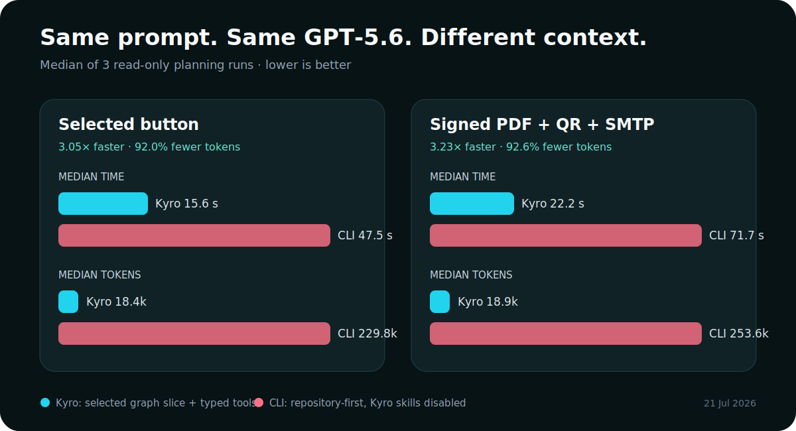

# Kyro — Visual Low-Code Studio

> **Design like a creative tool. Program through a graph. Give Codex the exact context it needs.**

Kyro is an open, local-first visual studio for building real Web, PWA, and Android applications. Pages, components, events, flows, data, native capabilities, and generated files live in one versioned Graph. A visual user can build without AI; when a request becomes difficult, **Ask Codex** receives the selected graph slice and proposes a typed, reviewable, verifiable transaction.

Built with **Codex and GPT‑5.6** for the **OpenAI Build Week 2026 — Developer Tools** track.

| Design visually | Ask Codex in context |
| --- | --- |
|  |  |

## Why I built Kyro

Visual builders are welcoming until the product needs real behavior. Code agents are powerful, but they usually meet a repository before they understand what the user selected, what that component means, or which flows and data depend on it.

Kyro closes that gap. The interface is not a mock-up placed in front of the program: **it is the entry point to the program**.

1. Draw the interface with familiar direct manipulation.
2. Select an element and see its actions, bindings, dependencies, and errors.
3. Connect behavior through reusable Node-RED-style flows.
4. Ask Codex for the difficult part without copying a selector or explaining the whole repository.
5. Review the plan, apply one verified transaction, inspect Preview, and undo it atomically.
6. Export readable code that keeps working outside Kyro.

The goal is not to replace the user with AI. It is to let a visual thinker keep ownership of the product while Codex handles complexity at the exact point where it appears.

## What makes Kyro different

- **Graph-native, not prompt-native.** Design, state, flows, data, services, permissions, and provenance share stable IDs in one source of truth.
- **Real contextual Codex.** Ask Codex always calls authenticated Codex; Kyro skills and typed tools guide it but never replace the model with a scripted answer.
- **Capability Resolver as an adviser.** If a feature needs storage, a backend, a provider, credentials, permissions, or a package, Kyro explains the missing pieces to Codex and keeps activation behind review.
- **Safe self-extension.** An unsupported request can become a global, versioned capability draft with typed inputs, outputs, permissions, dependencies, tests, and an activation gate. It is never presented as working before implementation and verification.
- **Manual and AI parity.** A manual edit and a Codex edit pass through the same Core, Transaction Engine, Verification pipeline, Runtime, Preview, and Export.
- **No lock-in.** Projects are local and versionable. Web/PWA exports are readable TypeScript/Vite; Android exports use Capacitor and can be built independently.
- **Codex remains optional.** Design, data, actions, flow debugging, Preview, and Publish remain usable without AI.

| Reusable visual behavior | Visual data and bindings |
| --- | --- |
|  |  |

## Measured: graph context versus repository-first Codex

We ran the same two prompts through two authenticated GPT‑5.6 paths on the same Windows workstation:

- **Kyro:** selected component + approximately 5.2 KB indexed graph slice + specialized typed tools.
- **Repository CLI:** Codex at the same repository root and commit, with Kyro project skills disabled and no Live Bridge.

Both paths used `gpt-5.6-sol`, low reasoning effort, read-only planning, and no mutation. Each cell is the median of three fresh runs.

| Identical prompt | Kyro median | Repository CLI median | Result |
| --- | ---: | ---: | --- |
| Change the selected button, preserve ID/styles, verify Preview | **15.6 s · 18.4k tokens** | 47.5 s · 229.8k tokens | **3.05× faster, 92.0% fewer tokens** |
| Signed PDF + QR + SMTP; derive a reusable capability if missing | **22.2 s · 18.9k tokens** | 71.7 s · 253.6k tokens | **3.23× faster, 92.6% fewer tokens** |



Quality mattered as much as speed. Kyro produced a stable-ID typed operation in 3/3 button trials and a schema-valid, review-gated global capability proposal in 3/3 capability trials. The CLI produced useful reasoning, especially for the capability, but it could not bind a transaction to the active visual selection because that selection does not exist in source files.

This is a small local engineering benchmark, not a universal performance claim. The paths intentionally differ in context because that is the feature under test. Exact prompts, trial values, method, limitations, and the reproducible runner are in [`docs/benchmarks/2026-07-21-kyro-vs-repo.json`](./docs/benchmarks/2026-07-21-kyro-vs-repo.json) and [`scripts/benchmark-codex-context.mjs`](./scripts/benchmark-codex-context.mjs).

## Install in one command

Supported: **Windows, macOS, and Linux**, with Node.js 20+, npm, Git, and a Chromium-based browser.

```bash
npm install -g https://github.com/Musca420/kyro-visual-low-code-studio/releases/download/v2.0.0/kyro-studio-2.0.0.tgz
kyro --home
```

Then:

- run `kyro` inside an existing project folder to import and open it;
- run `kyro` elsewhere to open Home and create or import visually;
- run `kyro path/to/project` to choose a folder explicitly;
- run `kyro --check` to inspect what Kyro would open without starting it.

Kyro binds only to `127.0.0.1`, and project state stays in local IndexedDB. Android export additionally requires the Android SDK. The repository contains desktop-shell source for continued development, but no unsigned Windows installer is presented as a supported judge install.

### Build from source

```bash
git clone https://github.com/Musca420/kyro-visual-low-code-studio.git
cd kyro-visual-low-code-studio
npm ci
npm run check
npm link
kyro --home
```

## Five-minute judge path

1. Start `kyro --home` and create a blank project or import a folder.
2. Add a page, drag components onto the canvas, resize and nest them, then switch Desktop, Tablet, and Mobile.
3. Select a component, open **Actions**, choose an event, and connect visual nodes in **Flow**.
4. Right-click the component, choose **Ask Codex**, inspect the captured context and typed plan, then approve and undo once.
5. Add a local IndexedDB source, bind a form or list, and exercise success, validation, empty, loading, and error states.
6. Open **Preview**, then **Publish** a Web/PWA or Android export.

Judges can test generated outputs without rebuilding Kyro from the [NexusField demo release](https://github.com/Musca420/kyro-visual-low-code-studio/releases/tag/v0.1.15), which includes an independent Web/PWA export, Android APK, test evidence, and demo assets.

| Publish an independent Web/PWA | Verify the generated Android app |
| --- | --- |
|  |  |

## How Codex and GPT‑5.6 were used

Codex with GPT‑5.6 was both the main engineering collaborator during Build Week and the reasoning engine embedded behind Ask Codex.

The human decisions shaped the product: visual-first interaction, Canva-like direct manipulation, a single open Graph, local-first storage, explicit approval for capabilities and dependencies, generic fixes instead of demo-specific shortcuts, and exports that remain useful outside Kyro. Development happened as repeated goal loops: define a verifiable outcome, implement the smallest vertical slice, run tests, use the product visually, correct the root cause, and capture evidence.

Codex accelerated repository analysis, architecture work, implementation, test generation, visual browser verification, Android deployment, security review, benchmark design, and release documentation. Inside Kyro, GPT‑5.6 receives only the relevant project brief, page, selected stable component, semantic intent, nearby dependencies, linked flows and data, runtime errors, revision, and available typed operations. Planning is read-only; approved mutations pass through the same Transaction Engine and Verification used by manual edits.

The main Build Week session ID and safe session metadata are documented in [`CODEX_SESSION_EVIDENCE.md`](./CODEX_SESSION_EVIDENCE.md). No credentials, account tokens, or private conversation transcript are committed.

## Build Week boundary

Kyro began as a pre-existing local visual-editor prototype. Commit [`38a72eb`](https://github.com/Musca420/kyro-visual-low-code-studio/commit/38a72eb3467d28371a9c3d0894753a3c2bcf9321) is the imported baseline dated **18 July 2026**. The dated commits after that point are the Build Week extension: unified graph context, stable contextual selection, Live Bridge, Codex transactions and undo, visual flows, data bindings and generated backend, native capability nodes, folder import, CLI, Web/PWA/Android export, security boundaries, and real browser/device verification.

See [`HACKATHON_COMPLIANCE.md`](./HACKATHON_COMPLIANCE.md) for the submission audit and the [official rules](https://openai.devpost.com/rules) for the authoritative requirements.

## Verification

```bash
npm run check
npm run test:e2e

npm run export:sample
npm --prefix generated-app install
npm --prefix generated-app run build
npm run test:generated
```

Current release evidence records **161 unit/integration tests passed** and **58 Playwright scenarios passed**, with three explicitly environment-gated scenarios. Fresh installed-CLI acceptance also covered beginner onboarding, Canva-style editing, a multipage Web app, a four-page data app, responsive Preview, persistence, CRUD with five UI-created records, export, Android `assembleDebug`, `adb install -r`, and launch on a physical phone.

The reproducible manifest and proof bundle are in [`release/kyro-2.0.0-evidence.zip`](./release/kyro-2.0.0-evidence.zip). Additional reports: [`NEXUSFIELD_VALIDATION_REPORT.md`](./NEXUSFIELD_VALIDATION_REPORT.md), [`CHANGELOG.md`](./CHANGELOG.md), and [`ROLLBACK.md`](./ROLLBACK.md).

## Architecture in one minute

```text
Visual Editor ─┐
Ask Codex ─────┼─> typed operation ─> Transaction Engine ─> Verification ─> Graph revision
Manual Flow ───┘                                                        │
                                              Runtime <─ Preview <─ Export
```

- `src/model.ts` — validated, versioned unified Graph.
- `src/projectCore.ts` and `src/transactionEngine.ts` — authority, atomic mutations, revision, audit, rollback.
- `src/flow.ts` — deterministic visual-flow runtime and traces.
- `src/PreviewFrame.tsx` — sandboxed interactive Preview using the shared Runtime.
- `src/generator.ts` — readable Web/PWA/Android generation and local backend.
- `src/CodexPanel.tsx` — context, plan, approval, evidence, history, and undo.
- `server/kyroMcp.mjs` — allow-listed typed tools for contextual Codex work.
- `.agents/skills/` — focused design, app, data, actions, native, extension, test, and publish workflows.

External providers, secrets, dependency installation, signing, paid services, and store publication remain behind explicit approval. Imported source is analyzed but never executed automatically.

## License and submission material

- [MIT License](./LICENSE)
- [Devpost submission copy](./DEVPOST_SUBMISSION.md)
- [Codex session evidence](./CODEX_SESSION_EVIDENCE.md)
- [OpenAI Build Week compliance](./HACKATHON_COMPLIANCE.md)

Copyright © 2026 Kyro contributors.
