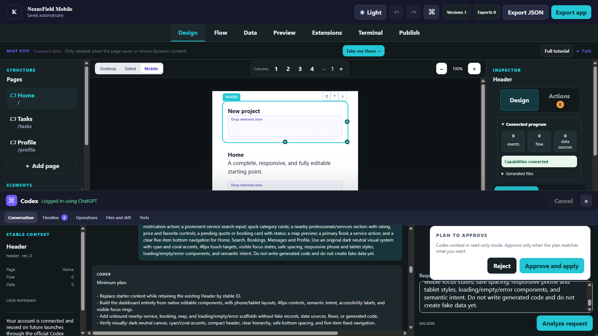

# Kyro — Visual Low-Code Studio

**Design like Canva. Program visually. Ask Codex exactly where the work lives.**

Kyro is an open, local-first visual programming studio for people who can describe and design a product but do not want code to be the first step. A page, component, event, flow, data source, native capability, and generated file are connected in one versioned graph. The result exports as readable TypeScript/Vite, PWA, and Capacitor Android projects—without vendor lock-in.

Built for the **OpenAI Build Week 2026 — Developer Tools** track.

| Design a real responsive interface | Turn intent into an inspectable Codex plan |
| --- | --- |
|  |  |

## The problem Kyro solves

Visual builders are approachable until a product needs non-trivial behavior; code-first agents are powerful but often begin by scanning a repository that does not express the designer's intent. Kyro joins those worlds:

1. The user draws what they want to see.
2. **Actions** exposes the selected element's events and available no-code operations.
3. Node-RED-style flows connect UI, state, data, APIs, permissions, and native features.
4. **Ask Codex** receives the current graph slice—not an unbounded repository search—and proposes typed changes.
5. Kyro previews, validates, records, and can undo the change as one transaction.
6. The same graph generates readable projects that run independently.

This makes the visual interface the entry point to the program, not a disposable mock-up.

## What makes it different

- **Context lives with the component.** Right-click any element and choose **Ask Codex**; no selector copying is required.
- **One source of truth.** Design, responsive styles, semantic intent, events, flows, data, native capabilities, and generated-file provenance share stable IDs in a unified graph.
- **Fast skills for routine work.** Kyro-specific skills route common requests directly to typed graph operations. Open-ended work can still use the full model.
- **Backend from visual intent.** The Capability Resolver explains missing storage, providers, permissions, credentials, costs, and local alternatives in plain English.
- **Agent changes remain governable.** Plans, diffs, validation, revision history, screenshots, and atomic undo are part of every transaction.
- **Local-first and open.** Projects persist locally, use a versionable format, and export code that can continue outside Kyro.
- **Visual and native.** The same flow system covers CRUD, APIs, camera, location, QR/barcode, notifications, deep links, files, sharing, haptics, network state, and platform conditions.

| Reusable, debuggable visual flows | Visual data sources and bindings |
| --- | --- |
|  |  |

## Measured agent speed-up

The persisted **NexusField** timeline contains both the original model-driven path and the later skill-routed path. For a controlled task family—connecting a visual component to an existing data source—we measured completed runs from the same machine and development session.

| Stage | Samples | Median | p90 |
| --- | ---: | ---: | ---: |
| Classic Codex planning | 28 | 18.079 s | 21.747 s |
| Kyro skill planning | 33 | 0.292 s | 0.325 s |
| Shared transaction apply | 61 | 2.470 s | 2.907 s |

That is a **61.9× median planning speed-up**. Including the shared apply stage gives an estimated median of **20.549 s classic versus 2.762 s skill-routed: 7.4× end to end**.

This is a historical cohort comparison of the same operation class, not identical repeated prompts, and the end-to-end value is the sum of stage medians. The classic path already received Kyro's compact context; a whole-repository scan was not timed and would not be a fair source of live IndexedDB state. The result is therefore a conservative comparison, not a claim about every Codex task. Full Codex remains available for ambiguous or custom work. Method and session evidence are recorded in [CODEX_SESSION_EVIDENCE.md](./CODEX_SESSION_EVIDENCE.md).

## Install and start Kyro

The supported editor installation is the repository-first CLI. It works consistently on Windows, macOS, and Linux and avoids unsigned desktop-binary warnings.

Requirements: **Node.js 20+**, npm, Git, and a Chromium-based browser.

```bash
git clone https://github.com/Musca420/kyro-visual-low-code-studio.git
cd kyro-visual-low-code-studio
npm ci
npm link
kyro
```

- Run `kyro` in an existing web project folder to import and open it.
- Run `kyro` in any other folder to open Home and create/import visually.
- Run `kyro path/to/project` to choose a folder explicitly.
- Run `kyro --home` to always open Home.
- Run `kyro --check` to inspect what would open without starting it.

Kyro binds only to `127.0.0.1`; project state stays in local IndexedDB. Android export requires the Android SDK. The desktop source remains in the repository for development, but **no unsigned Windows desktop package is presented as a supported judge install**. A public desktop installer requires platform signing and is intentionally deferred rather than asking users to bypass operating-system security.

## Five-minute judge path

1. Start `kyro` and create a project from a template or import a folder.
2. Add a page and drag components onto the canvas; resize, nest, style, and switch desktop/tablet/mobile.
3. Select a component, open **Actions**, choose an event, and connect visual nodes.
4. Right-click it, choose **Ask Codex**, review the captured context and typed plan, then approve and undo once.
5. Add an IndexedDB or generated local REST source; bind a list or form and exercise CRUD states.
6. Open **Preview**, then **Publish** to export Web/PWA or prepare Android.

Judges can also test generated outputs without rebuilding Kyro from the [v0.1.14 release](https://github.com/Musca420/kyro-visual-low-code-studio/releases/tag/v0.1.14): a standalone NexusField Web/PWA export, an Android APK, Playwright traces, and the narrated demo.

| Configure an independent Web/PWA export | Verified on a physical Android device |
| --- | --- |
|  |  |

## Codex collaboration and human decisions

Codex with GPT-5.6 was the primary engineering and verification collaborator and is also embedded in Kyro. During Build Week it accelerated repository analysis, implementation, root-cause fixes, test generation, headed visual verification, Android deployment, reproducible evidence, and release documentation.

The human entrant directed the product: frontend-first visual programming, Canva-like usability, the unified open graph, local-first storage, explicit capability approval, independent exports, and the rule that test-project fixes must be generic rather than hard-coded. Development proceeded through explicit goals and repeated implementation → run → test → visual review → correction loops. The main session ID and safe metadata are in [CODEX_SESSION_EVIDENCE.md](./CODEX_SESSION_EVIDENCE.md).

Inside Kyro, Live Bridge supplies only the relevant project, page, stable selection, semantic intent, dependencies, linked flow/data, runtime errors, revision, screenshot, and generated-file provenance. Mutations are typed, validated, revisioned, and undoable.

## Build Week boundary

Kyro began as a pre-existing local visual-editor prototype. Commit [`38a72eb`](https://github.com/Musca420/kyro-visual-low-code-studio/commit/38a72eb3467d28371a9c3d0894753a3c2bcf9321) is the imported baseline snapshot dated **18 July 2026**; judges should evaluate the subsequent dated commits as the Build Week extension. Those commits add or substantially extend the unified graph, stable contextual selection, Live Bridge, agent transactions and undo, visual flows, data bindings/generated backend, native capability nodes, folder import, CLI, Web/PWA/Android export, and real browser/device verification. See [HACKATHON_COMPLIANCE.md](./HACKATHON_COMPLIANCE.md) for the submission checklist.

## Verification

```bash
npm run check
npm run test:e2e

npm run export:sample
npm --prefix generated-app install
npm --prefix generated-app run build
npm run test:generated
```

The final validation currently records **131 unit tests passed** and **48 Playwright scenarios passed**, with three environment-gated scenarios intentionally skipped. Kyro's visible Publish UI was also used to run the Web export independently and install the generated APK with `adb install -r`. The physical-device path verifies authentication, shared backend mutations, queued offline writes and replay, keyboard resize, back navigation, native capabilities, and persistence. Full evidence: [NEXUSFIELD_VALIDATION_REPORT.md](./NEXUSFIELD_VALIDATION_REPORT.md).

## Architecture

- `src/model.ts` — versioned, validated unified visual graph.
- `src/editorOperations.ts` — typed transactional graph mutations and undo.
- `src/flow.ts` — deterministic visual-flow runtime with success/error paths and tracing.
- `src/PreviewFrame.tsx` — sandboxed interactive preview.
- `src/generator.ts` — readable Web/PWA/Android generation and local backend.
- `src/CodexPanel.tsx` — contextual Codex plan, diff, approval, validation, and history.
- `vite.config.ts` — workspace-scoped local Live Bridge.
- `.agents/skills/` — context, design, data, actions, native, extension, test, and publish skills.

Plugin contributions are declarative and validated; imported source is never executed during analysis. External providers, credentials, package installation, signing, store publication, and paid services require explicit approval. Codex output may include third-party or open-source material subject to its applicable license, so external packages and generated modules remain reviewable.

## Evidence and license

- [OpenAI Build Week compliance](./HACKATHON_COMPLIANCE.md)
- [NexusField Web/Android validation report](./NEXUSFIELD_VALIDATION_REPORT.md)
- [Codex session evidence](./CODEX_SESSION_EVIDENCE.md)
- [Devpost submission copy](./DEVPOST_SUBMISSION.md)
- [Original validation plan](./final_plan.md)
- [MIT License](./LICENSE)

Copyright © 2026 Kyro contributors. Released under MIT.
